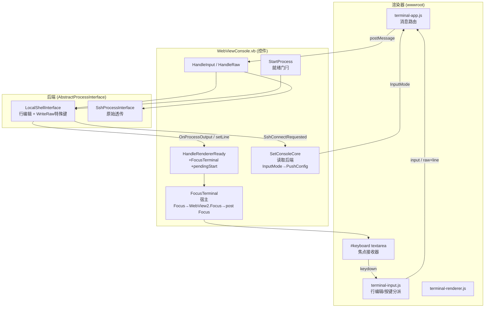

## 用户需求

基于 `console\WebView2\WebViewConsole.vb` 控件构建的 SSH 客户端，在窗体初始加载阶段挂载 `LocalShellInterface` 后，终端能正常显示 `user@machine:~ 提示符，但键盘按下任何键都没有任何回显，无法输入命令，因而无法通过本地 Shell 输入 `ssh ...` 发起连接。需要审查代码找出原因，并在 console 控件与 SShClient 客户端两侧同时修复。

## 产品概述

让 WebViewConsole 控件对"本地 Shell 后端"具备与"远程 SSH 后端"同等完善的支持：控件加载完成后终端自动获得键盘焦点，用户可直接输入命令；点击终端任意区域可恢复输入焦点；本地 Shell 阶段的行编辑（退格、方向键历史、Tab、Ctrl+C）行为符合终端惯例；本地 Shell 与 SSH 两种后端的输入模式在切换时自动适配，不需要使用方手工配置。

## 核心功能

- **终端焦点自愈**：渲染器就绪后自动把键盘焦点交给终端；控件获得焦点、终端区域被点击、窗体激活时都能正确把焦点递交到浏览器内的键盘接收器，保证按键立即产生本地回显。
- **后端切换与启动时序解耦**：绑定后端后即便渲染器尚未就绪也能正确启动，提示符与运行状态、输入模式在就绪后一并同步，不再依赖调用方的调用时机。
- **输入模式随后端自动切换**：本地 Shell 采用行编辑模式（本地回显、行内编辑、历史记录），SSH 会话采用原始透传模式（按键实时下发），切换由控件根据后端能力自动完成。
- **本地 Shell 特殊键支持**：
- Tab：基于内置命令与当前目录条目做前缀补全，唯一匹配直接补全，多匹配列出候选并重绘提示符与当前行。
- 上/下方向键：在本地命令历史中前后翻阅；左/右与 Home/End 支持行内光标移动。
- Ctrl+C：回显 `^C`，丢弃当前行，重新打印提示符。
- Ctrl+L：清屏并重绘提示符。
- **视觉效果**：终端加载完成后光标即处于闪烁可输入状态，输入字符即时回显；补全候选以多列形式列出；`^C` 与清屏行为与真实终端一致，整体保持现有终端配色与字体不变。

## 技术栈

- 语言/平台：VB.NET + WinForms（.NET Framework/.NET，沿用解决方案 `console.sln` 现状）
- 渲染层：WebView2（`Microsoft.Web.WebView2.WinForms`），通过虚拟主机 `terminal.invalid` 加载内嵌 `wwwroot` 资源
- 宿主与渲染器通信：JSON 消息（`TerminalMessage.vb` 出站 / `InboundMessage` 入站），`WebMessageReceived` 分发
- 前端：原生 JavaScript（`terminal-app.js` / `terminal-input.js` / `terminal-renderer.js`），无框架
- 不引入任何新依赖

## 根因结论（已在探索阶段确认）

1. **主因 —— 键盘焦点从未进入 WebView2**：

- JS 侧 `terminal-app.js` 初始化末尾虽调用了一次 `input.focus()`，但那是页面内焦点；WinForms 宿主 `WebViewConsole`（UserControl）自身从未被激活，WebView2 控件也未被 `Focus()`，操作系统层面的键盘焦点根本不在 WebView2 上，keydown 事件到不了 `#keyboard` textarea，因此连本地回显都没有。
- `WebViewConsole.vb` 中唯一会 post `TerminalMessage.Focus()` 的入口是 `OnGotFocus`（第 859-865 行），而 UserControl 未获焦点时它不会触发；`FocusTerminal()`（第 870-876 行）虽已实现，但**代码库内无任何调用点**。
- `HandleRendererReady`（第 519-539 行）完成了 `PushStyle` / `PushConfig` / `Scrollback` / `Flush`，唯独没有 focus 交接。

2. **次因 A —— `LocalShellInterface.WriteRaw` 为空实现**（第 107-109 行）：`SshWinFormConsole` 在 `InitializeComponent` 第 227 行就把 `SendKeyboardCommandsToProcess = True`，导致本地 Shell 阶段 Tab / Ctrl+C 被路由到 `WriteRaw` 后静默丢弃。
3. **次因 B —— 输入模式与后端语义错配**：本地 Shell 无 PTY，应走 JS 行编辑（`onLine`）；SSH 有 PTY，应走原始透传（`onRaw`）。当前由调用方在设计器里写死为透传，切换后端时无人调整。
4. **次因 C —— 启动时序耦合**：`SshWinFormConsole_Load` 阶段调用 `StartProcess()` 时 `m_rendererReady = False`，输出靠 `m_pending` 补发侥幸可用，但 `PushConfig`（输入模式）并未随后端切换重推，属于隐性脆弱点。

## 实现方案

### 总体策略

在控件侧建立**一条确定的焦点交接链**与**一次性的"后端能力驱动输入模式"机制**，把"什么时候能输入、以什么模式输入"从调用方手里收回到控件内部；在 SShClient 侧补齐 `LocalShellInterface` 的原始按键语义（Tab 补全 / 历史 / Ctrl+C / Ctrl+L），并移除设计器里写死的透传开关。

### 关键决策与取舍

**决策 1：焦点链在控件内部闭环，而不是要求调用方手动调 `FocusTerminal()`**

- 在 `HandleRendererReady` 末尾调用 `FocusTerminal()`，保证渲染器一就绪就拿到焦点。
- 重写 `FocusTerminal()`：先确保宿主 UserControl 自身被选中（`Me.Focus()` / `Parent.ActiveControl`），再 `WebView21.Focus()`，最后 post `TerminalMessage.Focus()`；若渲染器尚未就绪，置 `m_pendingFocus = True`，在 ready 时补做。
- 新增 `OnHandleCreated`/`OnVisibleChanged` 之外不额外挂钩，避免副作用；改由 `HandleRendererReady` + `OnGotFocus` + JS 侧 viewport mousedown 三处共同兜底。
- **取舍**：不去改 `WebViewConsole.Designer.vb` 的 `TabStop/TabIndex` 结构（避免影响既有布局与 Tab 顺序），而是通过运行期 `Focus()` 调用达成，改动面更小、回归风险更低。

**决策 2：新增"输入模式"抽象，由后端声明，控件自动应用**

- 在 `AbstractProcessInterface`（`console/Win32/AbstractProcessInterface.vb`）增加一个可重写的只读属性（默认返回"行编辑"或保持现状默认值以维持向后兼容），表达该后端期望的输入模式：行编辑（本地回显 + 行提交）或原始透传（逐键下发）。
- `WebViewConsole.SetConsoleCore` 在赋值后读取该属性并更新内部 `SendKeyboardCommandsToProcess` 的**有效值**，然后调用 `PushConfig()`（若渲染器未就绪，则由 `HandleRendererReady` 中已有的 `PushConfig()` 覆盖，天然幂等）。
- `SendKeyboardCommandsToProcess` 属性保留为公开 API，语义变为"显式覆盖"：调用方显式设置过则以调用方为准，未设置则跟随后端声明。用一个 `m_keyForwardingExplicit` 布尔记录是否被显式赋值，保证**向后兼容**（`test/` 与既有调用方行为不变）。
- **取舍**：不新建 `IInputModeProvider` 之类的新接口，而是在既有抽象基类上加虚属性——符合项目现有"抽象基类 + WithEvents 自动重绑"的模式，避免引入新架构概念（YAGNI）。

**决策 3：启动流程增加就绪门闩，消除时序耦合**

- `StartProcess()` 内若 `m_rendererReady = False`，仅记录 `m_pendingStart`，在 `HandleRendererReady` 中按顺序执行 `PushConfig` → `Flush` → 启动后端 → `FocusTerminal`。这样提示符必定在配置与焦点都就位之后打印，行为可预测。
- 需保持"若渲染器已就绪则立即启动"的同步语义，避免改变既有调用方对 `StartProcess()` 返回后即已运行的假设。
- **取舍**：不用 `Task`/`async` 改造 `StartProcess`（会传染整条调用链），只用一个布尔门闩，最小侵入。

**决策 4：本地 Shell 特殊键在后端（`LocalShellInterface.WriteRaw`）处理，而非 JS 侧硬编码**

- 理由：Tab 补全必须知道内置命令表与当前工作目录，这些状态只存在于 `LocalShellInterface`；放在 JS 侧会造成状态双写与跨语言耦合。
- 方向键历史/行内编辑仍保留在 JS 侧（`terminal-input.js` 已有行缓冲与历史能力），因为它们不依赖后端状态，本地处理延迟最低。
- 因此最终形态：**行编辑模式下 JS 处理可打印字符、退格、方向键历史、行提交；Tab 与 Ctrl 组合键作为原始序列下发给后端**。这要求 JS 侧在行编辑模式下仍允许映射键触发 `onRaw`（当前 `terminal-input.js` 中映射键触发 `onRaw` 受 `sendKeysToProcess` 门控），需要把 Tab/Ctrl-C/Ctrl-L 的下发与 `sendKeysToProcess` 解耦：改为"若该键存在于 keyMappings 中则始终 `onRaw`"，普通可打印字符仍按模式决定。
- Tab 补全需要后端知道"当前已输入但未提交的行内容"。方案：`onRaw` 下发的 Tab 序列附带当前行缓冲（在 raw 消息中带上 `line` 字段，由 `terminal-input.js` 填充当前缓冲；`InboundMessage` 增加对应可选字段）。后端补全后通过一条"替换当前行"的输出（回车 + 清行 ANSI + 提示符 + 新行内容）刷新显示，同时 JS 侧需要能被服务端要求重置行缓冲——通过新增一条出站消息类型 `setLine`（`TerminalMessage.vb` + `terminal-app.js` + `terminal-input.js`）实现，避免"屏幕显示"与"JS 行缓冲"不一致。
- **性能**：补全候选枚举限制在当前目录一层（`Directory.EnumerateFileSystemEntries` + 前缀过滤 + 上限如 200 条），避免大目录卡顿；命令历史用 `List(Of String)` 上限（如 500 条）环形淘汰。

**决策 5：SShClient 侧移除写死的透传开关**

- 删除 `SshWinFormConsole.InitializeComponent` 第 227 行的 `SendKeyboardCommandsToProcess = True`，改由后端声明驱动（`LocalShellInterface` 声明行编辑，`SshProcessInterface` 声明原始透传）。
- `SshWinFormConsole_Load` 中在 `StartLocalShell()` 之后调用 `ConsoleControl1.FocusTerminal()`（幂等，渲染器未就绪时会被挂起并在 ready 时补做），形成双保险。

## 实现要点

- **不破坏既有 API**：`SendKeyboardCommandsToProcess`、`SetConsoleCore`、`StartProcess`、`FocusTerminal` 全部保留原签名；`AbstractProcessInterface` 新增的属性必须有默认实现，`SshProcessInterface` 与 `test/` 下的既有后端无需改动即可编译通过（`SshProcessInterface` 显式重写为原始透传）。
- **幂等性**：`FocusTerminal()`、`PushConfig()` 可被重复调用；`HandleRendererReady` 可能因页面重载再次触发，需保证 `m_pendingStart` 只消费一次（消费后置 `False`）。
- **线程亲和**：`HandleRendererReady`、`FocusTerminal` 必须在 UI 线程执行；`WriteRaw` 可能由消息回调线程进入，其内部 `RaiseOutputEvent` 沿用现有 `Enqueue` 缓冲路径（已线程安全），不要在 `WriteRaw` 里直接触碰 UI。
- **错误处理**：Tab 补全枚举目录时用 `Try/Catch` 包裹（无权限目录、路径过长），失败时静默不补全，不抛到 `HandleRaw` 的 catch 里污染终端（`HandleRaw` 现有 catch 会把异常消息以红色写入终端）。
- **日志**：沿用 `ShowDiagnostics` 开关，仅在其为 `True` 时输出诊断行，避免污染正常会话；不新增日志框架。
- **爆炸半径控制**：JS 侧改动集中在 `terminal-input.js` 的按键分派与 `terminal-app.js` 的消息处理分支，不触碰 `terminal-renderer.js` 的渲染热路径，避免影响帧率；出站消息新增类型采用 `Select Case` 追加分支，旧版本消息全部保持原样。
- **回归验证点**：`test/` 下既有示例（使用 `ProcessInterface` 的普通进程后端）必须仍可正常输入输出；SSH 连接后 htop / Ctrl+C 中断仍生效。

## 架构设计



## 目录结构

```
g:/mini-R/src/console/
├── console/
│   ├── Win32/
│   │   └── AbstractProcessInterface.vb      # [MODIFY] 新增可重写的输入模式声明属性（默认值保持向后兼容），
│   │                                        #          供 WebViewConsole 在 SetConsoleCore 时读取以自动决定
│   │                                        #          行编辑 / 原始透传模式。仅加属性，不改既有 MustOverride 契约。
│   └── WebView2/
│       ├── WebViewConsole.vb                # [MODIFY] 核心修复文件。
│       │                                    #  1) HandleRendererReady：末尾按序执行 PushConfig → Flush →
│       │                                    #     消费 m_pendingStart 启动后端 → FocusTerminal()，并保证可重入幂等。
│       │                                    #  2) FocusTerminal：改为「宿主 UserControl.Focus() → WebView21.Focus()
│       │                                    #     → PostToRenderer(TerminalMessage.Focus())」三段式；渲染器未就绪时
│       │                                    #     置 m_pendingFocus 挂起。
│       │                                    #  3) StartProcess：渲染器未就绪则置 m_pendingStart 并返回，就绪后补启动。
│       │                                    #  4) SetConsoleCore：赋值后读取后端输入模式，更新有效的
│       │                                    #     SendKeyboardCommandsToProcess（仅在调用方未显式设置时），并 PushConfig()。
│       │                                    #  5) SendKeyboardCommandsToProcess setter：记录 m_keyForwardingExplicit。
│       │                                    #  6) 新增处理「设置当前行」出站消息的辅助方法，供后端 Tab 补全同步 JS 行缓冲。
│       ├── TerminalMessage.vb               # [MODIFY] 新增出站消息构造：SetLine(text)（用于 Tab 补全后同步 JS 行缓冲）。
│       │                                    #          沿用现有静态工厂 + 匿名对象序列化写法，保持命名风格一致。
│       ├── InboundMessage（位于 TerminalMessage.vb 或同目录）
│       │                                    # [MODIFY] raw 消息增加可选 Line 字段，承载 Tab 按下时的当前行缓冲内容。
│       └── wwwroot/
│           ├── terminal-input.js            # [MODIFY]
│           │                                #  1) 映射键（Tab / Ctrl-C / Ctrl-L）无论 sendKeysToProcess 为何值都触发
│           │                                #     onRaw，并在回调中附带当前行缓冲，使本地 Shell 也能收到特殊键。
│           │                                #  2) 新增 setLine(text) 方法：替换当前行缓冲与光标位置，供宿主
│           │                                #     Tab 补全后同步；同时触发重绘。
│           │                                #  3) 补齐/确认 上下方向键历史、左右/Home/End 行内光标移动。
│           │                                #  4) viewport mousedown 时无选区则把焦点还给 #keyboard（确认并加固）。
│           ├── terminal-app.js              # [MODIFY] 消息分派新增 setLine 分支 → input.setLine(text)；
│           │                                #          onRaw 回调改为透传 {type:'raw', data, line}；
│           │                                #          focus 消息处理确认会同时 input.focus() 与 renderer.setFocused(true)。
│           └── terminal.html                # [无需修改] 已有 #keyboard 焦点接收器
├── SShClient/
│   ├── LocalShellInterface.vb               # [MODIFY]
│   │                                        #  1) 重写输入模式属性 → 声明为「行编辑」。
│   │                                        #  2) 实现 WriteRaw：解析 Tab(0x09) / ETX(0x03) / FF(0x0C) 及 CSI 序列。
│   │                                        #     - Tab：基于内置命令表 + 当前工作目录条目做前缀补全；唯一匹配则
│   │                                        #       通过 SetLine 同步并重绘当前行；多匹配则换行列出候选（多列、
│   │                                        #       上限约 200 条）后重打提示符与原行。
│   │                                        #     - Ctrl+C(0x03)：输出 ^C + 换行，清空当前行（SetLine 空串），ShowPrompt()。
│   │                                        #     - Ctrl+L(0x0C)：清屏后 ShowPrompt() 并恢复当前行。
│   │                                        #     - 未识别序列：静默忽略，不抛异常。
│   │                                        #  3) 目录枚举全部 Try/Catch 包裹，失败即放弃补全。
│   │                                        #  4) 需要一个向宿主发出「设置当前行」的通道：复用现有事件机制或新增
│   │                                        #     一个事件由 WebViewConsole 订阅并转成 TerminalMessage.SetLine。
│   ├── SshProcessInterface.vb               # [MODIFY] 重写输入模式属性 → 声明为「原始透传」，保证连接后
│   │                                        #          Ctrl+C / 方向键 / Tab 逐键下发到远端 PTY（维持现有行为）。
│   └── SshWinFormConsole.vb                 # [MODIFY]
│                                            #  1) 删除 InitializeComponent 中写死的
│                                            #     ConsoleControl1.SendKeyboardCommandsToProcess = True（第 227 行附近），
│                                            #     改由后端声明驱动。
│                                            #  2) SshWinFormConsole_Load 中 StartLocalShell() 之后调用
│                                            #     ConsoleControl1.FocusTerminal() 作为双保险。
│                                            #  3) Connect() 切换到 SshProcessInterface 后同样调用 FocusTerminal()，
│                                            #     保证连接建立后焦点仍在终端。
└── test/                                    # [无需修改] 仅作回归验证：既有普通进程后端示例应保持可用
```

## 关键代码结构

```
' console/Win32/AbstractProcessInterface.vb —— 新增后端输入模式声明
Public Enum ConsoleInputMode
    ''' <summary>行编辑：渲染器本地回显与行编辑，回车后整行提交（无 PTY 的后端）。</summary>
    LineEdit = 0
    ''' <summary>原始透传：按键即时下发给后端（有 PTY 的后端，如 SSH）。</summary>
    Raw = 1
End Enum

Public MustInherit Class AbstractProcessInterface
    ''' <summary>后端期望的输入模式；默认行编辑，子类可重写。</summary>
    Public Overridable ReadOnly Property PreferredInputMode As ConsoleInputMode
        Get
            Return ConsoleInputMode.LineEdit
        End Get
    End Property
End Class
```

```
' console/WebView2/TerminalMessage.vb —— 新增出站消息
''' <summary>要求渲染器把当前输入行替换为指定文本（用于 Tab 补全同步）。</summary>
Public Shared Function SetLine(text As String) As String
```

## Agent Extensions

### SubAgent

- **code-explorer**
- Purpose: 在动手修改前，定位 `SendKeyboardCommandsToProcess`、`FocusTerminal`、`PushConfig`、`SetConsoleCore` 在 `console/`、`SShClient/`、`test/` 三个项目中的全部定义与调用点，并确认 `AbstractProcessInterface` 的现有子类清单（`ProcessInterface`、`SshProcessInterface`、`LocalShellInterface` 及 test 下的实现）。
- Expected outcome: 输出完整的符号引用清单与子类清单，确保新增虚属性与输入模式切换不遗漏任何调用方，避免破坏 `test/` 既有行为。