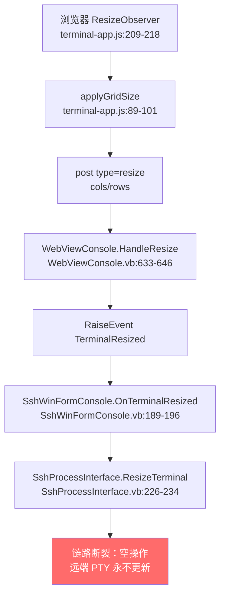

## 用户需求

修复 WebView2 终端模拟器控件（`console/WebView2/WebViewConsole.vb` 及其前端资源）在与 Linux SSH 交互时暴露的两个界面交互缺陷，要求先审查现有代码定位根因，再做针对性修复。

## 问题一：窗口尺寸未同步到远端 PTY

连接 SSH 后调整 WinForm 窗口大小时：

- htop / btop 等全屏 dashboard 类程序不会跟随重绘，仍按旧尺寸排版
- 渲染画面错乱，右边框无法对齐

期望效果：拖动窗口边缘后，终端网格与远端 PTY 尺寸实时保持一致，htop / btop 立即按新尺寸重绘，右边框严格对齐，无残留错行。窗口连续拖拽过程中不产生尺寸抖动或渲染撕裂。

## 问题二：ESC 键失效

在 WebViewConsole 中按下 ESC 键无任何反应：

- vim 编辑完文本后无法通过 ESC 退出插入模式，导致无法保存文件
- 其他依赖 ESC 的交互（取消菜单、退出全屏程序子模式）同样不可用

期望效果：ESC 键正常送达远端程序，vim 可正常在插入模式与普通模式之间切换并完成保存；ESC 不触发 WebView2 浏览器层的任何默认行为。

## 核心修复点

- 恢复终端尺寸变更向远端 SSH 会话的下发链路，使 PTY 收到窗口变更通知
- 补全键盘输入层对 ESC 键的处理，使其作为控制字符正确转发
- 保持窗口拖拽期间尺寸上报的稳定性与低开销
- 修正代码中与实际情况不符的错误注释说明

## 技术栈

沿用现有技术栈，不引入任何新依赖、不新增构建步骤：

- 宿主与后端：VB.NET WinForms（`console/`、`SShClient/`）
- SSH 后端：SSH.NET（Renci.SshNet）2025.1.0
- 终端渲染前端：原生 ES5 风格 JavaScript（IIFE + `var`，无打包工具）+ HTML + CSS，运行于 WebView2
- 通信通道：WebView2 `PostWebMessageAsString` / `postMessage`，JSON 报文

## 根因分析（已逐条读码核实）

### 问题一根因：`ResizeTerminal` 是彻底的空操作

尺寸同步链路除最后一环外全部畅通：



`SshProcessInterface.vb` 第 226-234 行现状：

```
Public Sub ResizeTerminal(columns As UInteger, rows As UInteger)
    columns = columns
    rows = rows
End Sub
```

`columns = columns` / `rows = rows` 为参数自赋值，不产生任何副作用。远端 PTY 永远停留在 `StartProcess`（第 116-118 行）中 `CreateShellStream` 建立时的初始尺寸，因此：

- 远端不会收到 `window-change` 请求，不会向前台进程组投递 SIGWINCH，htop / btop 不重绘
- 本地网格已按新列数排布，远端仍按旧列宽输出，二者错位 → 右边框不对齐、画面错乱

**两个症状同源，修好这一处即可同时消除。**

该方法上方的 XML 注释断言「SSH.NET 2025.1.0 ShellStream no longer exposes a runtime resize API」，此判断与事实不符。经核对 SSH.NET 源码 `src/Renci.SshNet/ShellStream.cs`，公开方法确实存在：

```
public void ChangeWindowSize(uint columns, uint rows, uint width, uint height)
```

内部调用 `_channel.SendWindowChangeRequest(...)`；`columns`/`rows` 为字符行列数，`width`/`height` 为像素（为 0 时由行列数决定）；流已释放时抛 `ObjectDisposedException`。

### 问题二根因：ESC 未被任何分支覆盖

`terminal-input.js` 第 16-39 行的 `SPECIAL_KEYS` 表中**没有 `Escape` 条目**。`handleKeyDown`（第 228-359 行）依次处理 Ctrl+C/Ctrl+V、Shift+PageUp/PageDown、Enter、Backspace、Delete、方向键、Home/End、Tab、Ctrl+字母，第 348 行再查 `SPECIAL_KEYS[e.key]`。`Escape` 全部落空，最终走到函数末尾「Printable characters fall through to the `input` event」。

但 ESC 不是可打印字符，隐藏 textarea 的 `input` 事件永远不会为它产生值 → 按键被静默丢弃 → vim 无法退出插入模式。

## 实现方案

### 一、恢复 SSH 运行时窗口尺寸下发

改写 `SshProcessInterface.ResizeTerminal`，使其真正调用 `shell.ChangeWindowSize`：

- **签名调整**：改为接受列/行 + 可选像素宽高，像素维度传 0（与 `CreateShellStream` 现有做法一致，让远端以行列数为准），保持对现有调用点 `ResizeTerminal(Columns, Rows)` 的兼容
- **状态同步**：先把新尺寸写入 `Columns` / `Rows` 属性，使断线重连时 `CreateShellStream` 能沿用最新尺寸，再下发到当前活动会话
- **防御式写法**：完全对齐类内 `WriteInput`（第 190 行）/ `WriteRaw`（第 212 行）的既有风格 —— 先判 `shell Is Nothing OrElse client Is Nothing OrElse Not client.IsConnected` 直接返回，再 `Try/Catch` 包裹调用
- **并发安全**：`ResizeTerminal` 由 UI 线程触发，而 `StopProcess` 可能在后台读线程收到 EOF 后执行并将 `shell` 置空，两者存在竞态。沿用类内既有 `sync` 锁对象保护，并在锁内取局部引用后再调用，避免检查与使用之间 `shell` 被置空导致 `NullReferenceException`
- **异常兜底**：捕获 `ObjectDisposedException` 与一般异常。尺寸下发失败属非致命，静默吞掉或按既有风格 `RaiseErrorEvent`，绝不能让异常冒泡到 UI 线程中断窗口拖拽
- **修正注释**：删除「不再暴露运行时 resize API」的错误论断，改为说明实际调用的 API 与像素维度取 0 的原因

### 二、补全 ESC 键处理

在 `terminal-input.js` 中：

- 在 `SPECIAL_KEYS` 表补入 `Escape: '\x1b'`，与表内其他控制序列保持同一组织方式，避免散落的 if 分支
- 在 `handleKeyDown` 中为 ESC 增加显式分支，参照 Tab（第 331-337 行）「两种模式都转发」的既有思路：ESC 是控制信号而非文本，行编辑模式下本地缓冲区也应有合理响应（清空当前未提交输入行），raw 模式下直接 `emitRaw('\x1b')`
- **必须调用 `e.preventDefault()`**，防止 WebView2 中 ESC 触发浏览器默认行为（中止页面加载、退出全屏等）
- 注意分支插入位置需在第 348 行通用 `SPECIAL_KEYS` 查表之前，否则会被那段「仅 `sendKeysToProcess` 为真才转发」的逻辑截获，导致行编辑模式下行为不一致

### 三、尺寸上报的稳定性与性能

窗口拖拽会在极短时间内触发大量 `ResizeObserver` 回调，每次都可能形成一条「JS → WebMessage → VB 事件 → SSH window-change 网络包」的完整链路。现有代码已有两层天然节流：

- `terminal-app.js` 第 91-93 行：`applyGridSize` 在 cols/rows 未变化时提前返回，像素级抖动不会放大成消息
- `WebViewConsole.vb` 第 638-640 行：`HandleResize` 同样在尺寸未变时直接返回，不触发事件

字符网格的粒度（一个 cell 约十几像素）本身就是有效的量化器，拖拽一次通常只产生个位数的实际尺寸变更。因此**不额外引入 debounce 定时器**，避免为低频事件增加状态机与延迟，符合 KISS 与 YAGNI。若实测在极端高频拖拽下仍有明显网络抖动，再在 `terminal-app.js` 的 `ResizeObserver` 回调处补一层轻量 `requestAnimationFrame` 合并即可，作为可选增强而非默认方案。

### 四、右边框对齐的复核

`terminal-renderer.js` 第 94-118 行 `computeGridSize` 中，`cellWidth` 取自 `getBoundingClientRect().width / sample`（小数），列数用 `Math.floor(width / cellWidth)`，第 108-112 行在无滚动条时预留 12px 滚动条宽度。该逻辑本身是保守取整，不会导致列数偏大而溢出。

右边框错位的直接成因是远端 PTY 列数与本地网格列数不一致，属问题一的衍生现象。修复尺寸下发后应自动消除。本次**不改动 `computeGridSize` 的取整策略**，避免在真实成因已被修掉的情况下引入不必要的渲染层变更，扩大回归面。修复后若仍存在稳定的一列偏差，再单独评估滚动条预留宽度与小数像素累积。

## 实现要点

- **不改动通信协议**：`resize` 报文的 `cols` / `rows` 字段与 `TerminalMessage` / `InboundMessage` 结构完全不动，改动全部收敛在链路两端
- **不改动 `WebViewConsole.vb`**：该文件中 `HandleResize` 与 `TerminalResized` 事件均工作正常，无需触碰（该文件当前在用户 IDE 中打开且有未提交改动，避免制造冲突）
- **风格一致性**：VB 侧沿用 `SyncLock sync` + 防御式判空 + `Try/Catch` + `RaiseErrorEvent`；JS 侧沿用 ES5（`var`、无箭头函数、无 `const`/`let`）
- **注释语言**：现有注释均为英文且写得详尽，新增与修改的注释一律沿用英文风格
- **最小改动面**：仅动两个文件，不做无关重构
- **Git 安全**：用户当前有较多未提交改动，全程不执行任何 git 提交、暂存或回滚操作

## 目录结构

```
g:/mini-R/src/console/
├── SShClient/
│   └── SshProcessInterface.vb          # [MODIFY] 核心修复。重写第 226-234 行 ResizeTerminal：
│                                       #   调用 shell.ChangeWindowSize(columns, rows, 0, 0) 真正下发
│                                       #   window-change 请求；同步更新 Columns/Rows 属性供重连复用；
│                                       #   用 SyncLock sync 取局部 shell 引用规避与 StopProcess 的竞态；
│                                       #   Try/Catch 捕获 ObjectDisposedException 及一般异常并静默/
│                                       #   RaiseErrorEvent，禁止异常冒泡打断 UI 拖拽；
│                                       #   删除「SSH.NET 不再暴露 runtime resize API」的错误 XML 注释，
│                                       #   替换为对实际 API 与像素维度取 0 的准确说明。
│                                       #   风格严格对齐同文件 WriteInput/WriteRaw 的防御式写法。
└── console/WebView2/wwwroot/
    └── terminal-input.js               # [MODIFY] ESC 修复。在 SPECIAL_KEYS 表补入 Escape: '\x1b'；
                                        #   在 handleKeyDown 中、通用 SPECIAL_KEYS 查表分支之前插入
                                        #   显式 Escape 分支：必须 e.preventDefault() 阻止 WebView2
                                        #   默认行为；raw 模式 emitRaw('\x1b')；行编辑模式同样转发并
                                        #   清空本地未提交缓冲区（参照 Tab 分支两种模式都转发的思路）。
                                        #   保持 ES5 风格与英文注释。
```

## 验证要点

- SSH 连接后运行 htop / btop，拖动窗口边缘，确认程序即时重绘、右边框与窗口右侧严格对齐、无残留错行
- 连续快速拖拽窗口，确认无异常抛出、无渲染撕裂、无明显卡顿
- SSH 会话中运行 vim，进入插入模式输入文本后按 ESC，确认可退回普通模式并通过 `:wq` 成功保存
- 确认 ESC 不触发 WebView2 层的默认行为
- 回归验证既有输入能力不受影响：Tab 补全、Ctrl+C 中断、方向键历史、Home/End、复制粘贴
- 回归验证本地 shell（`LocalShellInterface`）行编辑模式下 ESC 与尺寸变化行为正常，不产生异常
- SSH 会话断开后自动回落本地 shell 的流程不受影响