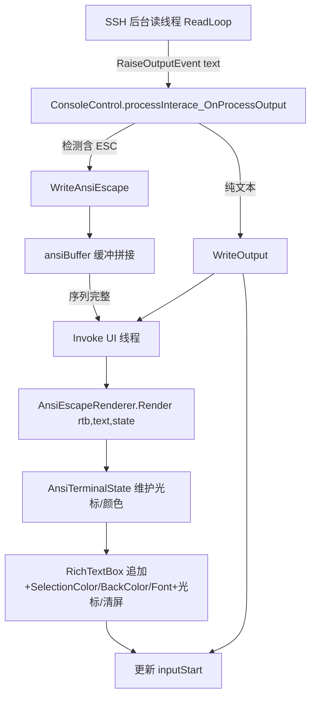

## 用户需求

完善 console 基础 WinForm 控件的 ANSI escape 渲染能力，使基于该控件的 SSH WinForm 客户端能够较完善地渲染 Ubuntu (xterm) 服务器返回的 ANSI escape sequence 输出。

## 产品概述

当前 `ConsoleControl` 提供 `WriteOutput`（纯文本）与 `WriteAnsiEscape`（ANSI 渲染）两套输出路径，但 `WriteAnsiEscape` 在状态一致性、背景色、光标/清屏序列、回车重绘、跨线程安全、与 `inputStart` 输入区协调等方面存在兼容性问题。SSH 客户端目前仍走 `WriteOutput` 纯文本路径。目标：重写 `AnsiEscapeRenderer` 实现完整的 xterm 兼容解析，并让 SSH 输出默认走 ANSI 渲染，同时保证与现有纯文本/输入逻辑的兼容。

## 核心功能

- 完整解析 SGR：标准前景/背景(30-37/40-47)、亮色(90-97/100-107)、256色(38;5;n / 48;5;n)、真彩色(38;2;r;g;b / 48;2;r;g;b)、样式(粗体/弱化/斜体/下划线/闪烁/反显/隐藏)、重置(0/39/49)。
- 支持光标控制序列：`H`/`f`(定位)、`A`/`B`/`C`/`D`(上下左右)、`E`/`F`、`G`(列)、`s`/`u`(保存恢复)、`h`/`l`(模式，至少忽略)、`m` 之外以字母结尾的 CSI 序列安全忽略。
- 支持 Erase：清屏 `J`(0/1/2/3)、清行 `K`(0/1/2)。
- 支持回车 `\r` 就地重绘与退格 `\b`，覆盖 prompt 刷新、进度条等场景。
- 用 RichTextBox 的 `SelectionBackColor` 精确渲染背景色。
- 渲染状态以控件实例为单位维护（非静态），默认态与 `ConsoleControl` 黑底白字一致；支持跨多次输出的格式延续（需配合缓冲解决分片）。
- SSH 后台读线程输出经 `Invoke` 切换到 UI 线程后渲染，保证线程安全。
- SSH 输出默认走 ANSI 渲染路径；分段到达导致转义序列被截断时，在控件内做缓冲拼接，确保整段序列完整后再渲染。
- 维持 `inputStart` 与输入区/历史区逻辑不变，ANSI 渲染同样更新 `inputStart`，避免输入定位错位。

## 技术栈

- 语言/框架：VB.NET + Windows Forms（目标框架 net10.0-windows）
- 渲染目标：System.Windows.Forms.RichTextBox（仅支持 SelectionColor / SelectionBackColor / SelectionFont）
- SSH 后端：Renci.SshNet（SSH.NET），后台读线程通过事件回调
- 既有模式：ConsoleControl 以 `Invoke` 包裹所有 RTB 写操作；`WriteOutput` 末尾更新 `inputStart`；`AbstractProcessInterface.RaiseOutputEvent` 推送文本

## 实现方案

### 总体策略

将 `AnsiEscapeRenderer` 从「一次性、静态状态、仅 SGR(m)」重写为「基于实例的、支持光标/清屏/回车、可处理分片缓冲」的 ANSI/xterm 终端模拟器。ConsoleControl 端增加：ANSI 检测分流（含 ANSI 走 `WriteAnsiEscape`）、跨输出缓冲（解决序列跨包截断）、`inputStart` 维护、线程安全 `Invoke`。

### 关键技术决策

1. **渲染器实例化为态**：新增 `AnsiTerminalState` 实例类（前景/背景/样式/光标位置/已保存光标），渲染器 `Render` 接收 `(RichTextBox, text, state)`，`state` 由 ConsoleControl 在控件生命周期内持有。消除当前 `Shared` 静态状态跨控件串扰的问题。
2. **默认态对齐黑底白字**：初始 `ForeColor=White`、`BackColor=Black`，与 `ConsoleControl.designer.vb` 的 RTB 默认值一致，解决普通文本渲染成黑字不可见问题。
3. **背景用 `SelectionBackColor`**：在段落应用阶段设置 `rtb.SelectionBackColor = segment.BackColor`，替代当前被丢弃的实现。
4. **光标/清屏用 RTB 实时编辑**：解析到 `\r`/`\b`/`H`/`A-D`/`J`/`K` 时，在追加文本的同时移动 `SelectionStart`、删除/覆盖目标区域（基于已知 `TextLength` 与光标行列映射）。因 RichTextBox 为纯文本无真实行列网格，采用「以字符偏移近似行列、按列宽估算行宽」的轻量模型（行宽用控件 ClientSize/字符宽度），满足 Ubuntu 常规重绘。
5. **分片缓冲**：ConsoleControl 维护 `ansiBuffer As StringBuilder`，`WriteAnsiEscape` 先追加到缓冲；若缓冲末尾处于未结束的转义序列中（以 ESC 开头但未遇到结束字母），暂不渲染，等待下次数据；否则整体渲染并清空缓冲。保证 SSH 分包不破坏序列。
6. **线程安全**：`WriteAnsiEscape` / `WriteOutput` 统一 `If Not IsHandleCreated Then Return` 后 `Invoke`；渲染器内部不再自行 `SendMessage(WM_SETREDRAW)`（保留可选挂起，但在 Invoke 内执行）。
7. **分流逻辑**：`processInterace_OnProcessOutput` 改为检测文本是否含 ESC(`ChrW(&H1B)`)，含则 `WriteAnsiEscape`，否则 `WriteOutput`。错误/退出信息保持纯文本。

### 性能与可靠性

- 解析为单次线性扫描，O(n) 时间与 O(n) 临时分段内存；对高频小包（SSH 通常 4KB/包）开销可忽略。
- 用 `WM_SETREDRAW` 挂起+批量 `AppendText`+最后 `Invalidate` 降低重绘抖动（在 Invoke 内）。
- 光标重绘采用「定位+删除范围+插入」而非整段重绘，避免内容膨胀与滚动跳动。
- 缓冲仅在转义序列被截断时累积，正常整包立即渲染，避免无限延迟。

## 实现注意事项

- 严格复用 `ConsoleControl.Invoke` 模式，不新增线程模型。
- 保持 `WriteOutput` 的 `lastInput` 防回显重复逻辑不被 ANSI 路径破坏；ANSI 路径不触发该去重（服务器回显由 PTY 处理）。
- 不改动 `SshProcessInterface` 的解码与 `RaiseOutputEvent` 契约（仅调整 ConsoleControl 消费侧）；`GetConsoleFont` 反射可复用估算回车行宽。
- 保留对本地进程（ProcessInterface）纯文本路径的向后兼容：无 ANSI 时仍走 `WriteOutput`。
- 反显(7) 用「前景↔背景互换」近似；隐藏(8) 用与背景同色近似（RichTextBox 无隐藏属性）。

## 架构设计



## 目录结构

```
console/
├── AnsiEscapeRenderer.vb          # [MODIFY] 重写为实例态、支持完整 xterm 序列（SGR含256/真彩/亮色、光标H/ABCD/EG/su、清屏J/K、回车\b）、SelectionBackColor 背景、线性解析、可选 WM_SETREDRAW 挂起。新增内部 AnsiTerminalState 类与 TextSegment 结构。
└── WinForm/
    └── ConsoleControl.vb          # [MODIFY] 新增私有 ansiBuffer 与 ansiState；WriteAnsiEscape 改为缓冲+Invoke+更新 inputStart；processInterace_OnProcessOutput 改为按是否含 ANSI 分流；WriteOutput 保持原有。

SShClient/
└── SshWinFormConsole.vb          # [MODIFY/确认] 确认 Connect 后输出走 ANSI 路径；OnSshError/OnSshExit 保持 WriteOutput 纯文本；无需大改，仅验证终端类型 xterm 触发完整序列。
```

## 关键代码结构（要点）

- `AnsiTerminalState`（新增实例类）：持有 `ForeColor As Color`、`BackColor As Color`、`Style As FontStyle`、`CursorRow As Integer`、`CursorCol As Integer`、`SavedRow/SavedCol As Integer`，以及 `Reset()`（重置为白字黑底常规样式）。
- `AnsiEscapeRenderer.Render(rtb As RichTextBox, text As String, state As AnsiTerminalState)`：公共入口，`Invoke` 由调用方负责；内部完成解析与 RTB 写入。
- `ConsoleControl.WriteAnsiEscape(ansiText As String)`：缓冲拼接→判断是否可渲染→`Invoke`→`Render`→更新 `inputStart`。

## 可用扩展

### SubAgent

- **code-explorer**
- 用途：在重写 AnsiEscapeRenderer 与修改 ConsoleControl 时，跨文件检索所有调用 `WriteOutput`/`WriteAnsiEscape`/`inputStart`/`RaiseOutputEvent` 的位置，确认影响面与调用约定。
- 预期结果：产出精确的调用点清单，确保修改不遗漏本地进程路径与测试 Demo 的兼容性。