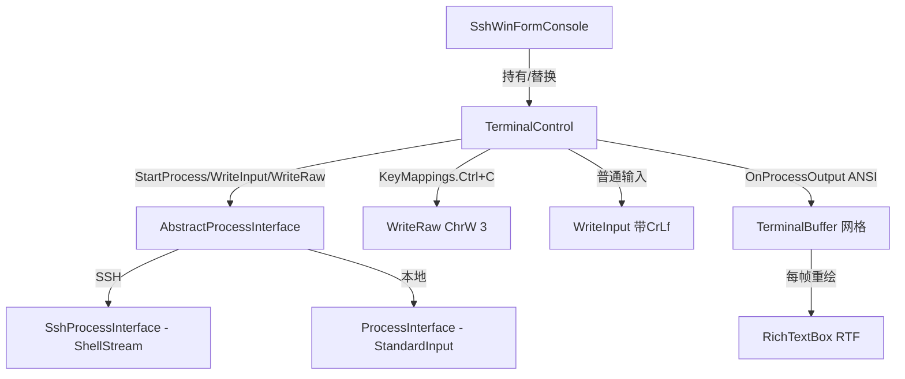

## 用户需求

当前项目是基于 RichTextBox 的 WinForm SSH 控制台控件，存在两个缺陷需修复：

## 核心功能

- 修复 Ctrl+C 中断信号发送：用户在控件上按下 Ctrl+C 时，需将裸 ETX（`\x03`）中断信号发送到 Ubuntu 服务器，能够中断 htop、top、ping 等前台运行命令。
- 修复 htop/btop 类程序的清屏重绘渲染：这类终端 dashboard 程序每帧先清屏（`ESC[2J`/`ESC[3J`）再定位光标（`ESC[H`）覆盖绘制新帧，当前控件无法正确清屏与定位，导致画面错乱。需通过内存字符网格模拟终端屏幕，实现正确的清屏、光标定位、行/屏擦除与覆盖重绘。
- 保留原 RichTextBox 控件模式，新建一个兼容原 `ConsoleControl` 公共接口的 `TerminalControl` 控件文件来实现更完整的终端渲染，不破坏现有 `ConsoleControl.vb`。
- 修复范围同时覆盖 SSH 客户端（`SshProcessInterface`）与本地进程（`ProcessInterface`）两端。

## 验证效果

- 连接 Ubuntu 后运行 `htop`，画面应每帧稳定刷新、无旧帧残留、无错位追加。
- 在运行 htop 时按 Ctrl+C，htop 退出并回到 shell 提示符。

## 技术栈选择

- 语言/框架：VB.NET + WinForms（沿用现有项目，.NET Framework/Standard，引用 SSH.NET）。
- 渲染控件：RichTextBox（保留），通过新增内存字符网格（`CharCell(,)`）模拟终端屏幕，再整体重绘到 RichTextBox。
- 后端：SSH.NET `ShellStream`（SSH 端）与 `Process.StandardInput`（本地端），两端均新增裸字节写入通道。

## 实现方案

### 整体策略

采用「内存字符网格 + RichTextBox 整体重绘」模式替代现有的「直接追加文本到 RichTextBox」模式。新建 `TerminalControl`（等价 `ConsoleControl` 的公共接口与事件），内部维护 `CharCell(,)` 网格（字符 + 前景色 + 背景色）、当前光标 `cursorRow/cursorCol`、以及屏幕 `Cols/Rows`（按 RichTextBox 字体尺寸与 ClientSize 计算）。ANSI 序列直接作用于网格，每次输出批次结束后（或定时）将网格渲染为 RTF/分段富文本写入 RichTextBox，从而原生支持 `ESC[H` 定位、`ESC[2J`/`ESC[3J` 清屏、行/屏擦除与覆盖重绘。

### 关键技术决策与权衡

1. **新建 `TerminalControl.vb` 而非改动 `ConsoleControl.vb`**：满足用户"保留原控件、新建兼容控件"的明确要求，避免影响现有本地控制台使用者；`SshWinFormConsole` 仅需将基/成员类型从 `ConsoleControl` 改为 `TerminalControl` 即可复用全部 SSH 逻辑。
2. **字符网格 + 整体重绘**：RichTextBox 无真实行列网格，无法直接定位覆盖。网格模型能完整支持 htop 的「清屏→定位→逐格绘制」语义。性能上每帧重绘整屏（如 80×24）开销极低；为避免高频重绘抖动，在 `WriteAnsi` 批次内累积修改，批次结束（Invoke 回调内）整屏重绘一次。
3. **Ctrl+C 裸信号**：新增 `AbstractProcessInterface.WriteRaw(input)`，SSH 端用 `shell.Write(Encoding.ASCII.GetBytes(input))`（不带 CrLf），本地端用 `inputWriter.Write(input)`（不带 NewLine）。Ctrl+C 命中 `KeyMappings` 后调用 `WriteRaw(ChrW(3))`，普通可打印字符仍走 `WriteInput`（带换行）。`KeyMappings` 中 Ctrl+C 映射改为裸 `ChrW(3)`，移除 `& vbCrLf`。
4. **复用现有 ANSI 颜色状态机**：`AnsiEscapeRenderer` 的 SGR（`m`）解析、16 色/256 色调色板、扩展色逻辑可整体迁移为网格单元着色，避免重复实现。

### 性能与可靠性

- 重绘频率：仅在输出批次完成（或 `Application.Idle`/定时约 30ms）时整屏重绘一次，避免逐字符刷新导致的闪烁与 CPU 抖动。
- 网格容量：以计算出的 `Cols×Rows` 初始化，超出部分按终端滚动语义上滚（删除首行、其余上移，光标回末行）。
- 向后兼容：`ConsoleControl` 完全不动；`TerminalControl` 暴露与 `ConsoleControl` 一致的 `WriteOutput`、`WriteAnsi`（或 `WriteInput`）、`StartProcess`、`StopProcess`、`IsProcessRunning`、事件等成员，保证 `SshWinFormConsole` 仅改类型名即可编译运行。

## 实现注意事项

- 保留 `ConsoleControl.vb` 原文件逻辑零改动。
- 字符网格渲染到 RichTextBox 时，使用 RTF 字符串（含 `\cf`、`\highlight` 颜色表）以获得稳定背景色与多色混合，比逐段 `SelectionColor` 性能更好且避免样式丢失；颜色表随状态动态构建。
- `SendKeyboardCommandsToProcess` 在 `SshWinFormConsole` 默认改为 `True`，确保 Ctrl+C/特殊键被拦截并转流；本地端同样生效。
- 本地进程 Ctrl+C：`inputWriter` 为 `Process.StandardInput`，发送 `\x03` 后由 Windows 控制台中断处理；若进程以 `cmd.exe` 运行，`\x03` 可触发中断。
- 退格（`\b`）、回车（`\r`）、换行（`\n`/`\r\n`）、制表符需映射为网格操作（退格前移一格、回车回行首、换行下移并视情滚动）。
- 避免引入新第三方依赖；仅在现有项目模式内扩展。

## 架构设计



## 目录结构

```
console/
├── WinForm/
│   ├── TerminalControl.vb     # [NEW] 兼容 ConsoleControl 的新终端控件。内部维护 CharCell(,) 网格、光标行列、屏幕行列数；实现 WriteOutput/WriteInput/WriteRaw 入口、ANSI 解析（H/f、A/B/C/D、J、K、m、\r\n\b）、网格到 RichTextBox 的 RTF 整体重绘；复用 ConsoleControl 的事件与属性签名。
│   └── ConsoleControl.vb      # [KEEP] 原控件不动，作为参考与本地控制台后端。
├── AnsiEscapeRenderer.vb      # [MODIFY] 将 CarriageReturn/EraseInLine/EraseInDisplay/CursorPosition 改造为可作用于外部网格的纯函数（或抽取为 TerminalBuffer 辅助），去除对 RichTextBox 文本的直接删除；保留并复用 SGR 颜色解析与调色板。
├── Win32/
│   ├── AbstractProcessInterface.vb  # [MODIFY] 新增 MustOverride WriteRaw(input As String)（裸字节/字符发送，不加换行），提供 RaiseRawInputEvent 复用现有事件链路。
│   └── ProcessInterface.vb          # [MODIFY] 实现 WriteRaw：inputWriter.Write(input)（不带 NewLine），本地 Ctrl+C 中断通道。
SShClient/
├── SshProcessInterface.vb     # [MODIFY] 实现 WriteRaw：shell.Write(Encoding.ASCII.GetBytes(input))（不带 CrLf）；WriteInput 仍附加 vbCrLf 用于普通命令。
└── SshWinFormConsole.vb       # [MODIFY] 将内部 ConsoleControl 成员类型改为 TerminalControl（InitializeComponent 与字段声明），默认 SendKeyboardCommandsToProcess = True；其余 SSH 逻辑（Connect/Disconnect/Resize）不变。
```

## 关键代码结构（接口级）

```
' TerminalControl 对外保持与 ConsoleControl 一致的核心签名
Public Class TerminalControl : Inherits UserControl
    Public Sub WriteOutput(output As String, color As Color)
    Public Sub WriteAnsi(ansiText As String)   ' 解析并作用于内部网格后整屏重绘
    Public Sub WriteInput(input As String, color As Color, echo As Boolean)
    Public Sub WriteRaw(raw As String)          ' 透传到 processInterface.WriteRaw
    Public Property SendKeyboardCommandsToProcess As Boolean
    ' 事件与属性对齐 ConsoleControl：OnConsoleOutput, OnConsoleInput, IsProcessRunning 等
End Class

' AbstractProcessInterface 新增
Public MustOverride Sub WriteRaw(input As String)

' 字符网格单元
Public Structure CharCell
    Public Ch As Char
    Public ForeColor As Color
    Public BackColor As Color
End Structure
```

## Agent Extensions

### SubAgent

- **code-explorer**
- 用途：在生成详细实现前二次核对 `ConsoleControl` 全部公共成员签名、`SshWinFormConsole` 对 `ConsoleControl` 的字段/方法引用，以及 `AnsiEscapeRenderer` 中可被网格复用的辅助方法，确保 `TerminalControl` 接口完全兼容、不遗漏成员。
- 预期结果：产出一份 `ConsoleControl` 必须对齐的公共接口清单与 `AnsiEscapeRenderer` 可复用方法清单，供编码阶段逐项落实。