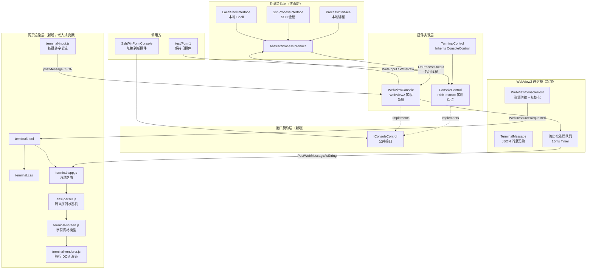

## 用户需求

将现有基于 RichTextBox 的 WinForm 终端模拟控件（`console/WinForm/ConsoleControl.vb`）迁移到基于 HTML + JavaScript + WebView2 的渲染方案，以解决 UI 性能低下与渲染错误问题。在 `console/WebView2/WebViewConsole.vb` 中构建一个全新的终端控件，其对外接口与现有 `ConsoleControl` 兼容，并能通过 ANSI Escape Sequence 完成终端渲染。

## 产品概述

一个可嵌入 WinForm 应用的终端模拟控件。控件内部宿主一个 WebView2 浏览器实例，终端画面由内置的 HTML/CSS/JavaScript 自研渲染器绘制。渲染器自行解析 ANSI 转义序列并维护字符网格（行 × 列），支持光标定位、屏幕/行擦除、滚屏与全套 SGR 文本属性，使 `htop`、`btop`、`vim` 等全屏重绘类程序能够正确显示。

控件对外暴露与现有 `ConsoleControl` 一致的属性、方法与事件，并通过抽取的公共接口 `IConsoleControl` 与旧控件形成可互换关系，使调用方（如 SSH 客户端）能够以最小改动切换实现。

## 核心功能

### 终端渲染

- 完整字符网格模型：光标定位、相对移动、保存/恢复光标位置
- 屏幕擦除（ESC[J，含 0/1/2/3 模式）与行内擦除（ESC[K，含 0/1/2 模式）
- SGR 文本属性：标准 16 色、亮色、xterm-256 调色板、24 位真彩色，以及粗体、斜体、下划线、删除线、反显、隐藏
- 控制字符处理：回车、换行、退格、制表符、响铃
- 超出屏幕时自动滚屏，并保留可回溯的历史回滚缓冲区

### 输入交互

- 键盘输入捕获并转换为终端字节流回传给后端会话
- 特殊按键映射：Tab、Ctrl+C（裸 ETX 控制字节，可中断远程程序）、方向键、功能键
- 命令历史上下翻阅
- 鼠标选中即复制、右键粘贴
- 支持只读模式与输入启用开关

### 外观与自适应

- 黑底白字默认配色，等宽字体（Consolas 风格）
- 字体、前景色、背景色可通过控件属性配置并实时同步到网页渲染层
- 控件尺寸变化时自动重算终端行列数，并通知后端调整伪终端窗口大小

### 接口兼容

- 抽取公共接口，新旧控件共同实现，调用方可无缝替换
- 保留现有输出写入、ANSI 写入、输入写入、清屏、启动/停止会话、绑定后端等全部对外能力
- 保留输出/输入事件通知

### 集成切换

- SSH 客户端切换为使用新的 WebView2 控件，验证真实交互场景下的表现

## 技术栈选型

沿用当前项目既有技术栈，不引入新的框架依赖：

- **宿主语言**：VB.NET，目标框架 `net10.0-windows`，`UseWindowsForms=true`
- **浏览器宿主**：`Microsoft.Web.WebView2` **1.0.4129.50**（已在 `console/console.NET5.vbproj` 与 `SShClient/SShClient.vbproj` 中作为 `PackageReference` 存在，无需新增依赖）
- **前端渲染**：纯手写 HTML + CSS + 原生 JavaScript（ES2020），**零第三方库**，按用户确认采用自研终端渲染器
- **资源分发**：HTML/CSS/JS 以 `EmbeddedResource` 编译进 `Microsoft.VisualBasic.Windows.Forms.Console.dll`，运行时通过 `CoreWebView2.WebResourceRequested` 拦截虚拟主机请求供给，无需部署额外物理文件
- **进程后端**：完全复用现有 `Microsoft.VisualBasic.Windows.Forms.Win32.AbstractProcessInterface` 抽象层（`ProcessInterface` / `SshProcessInterface` / `LocalShellInterface` 均无需改动）

## 实现策略

### 核心思路

把终端语义的「状态维护」与「像素渲染」整体下沉到 WebView2 内的 JavaScript 层：VB.NET 侧退化为**薄传输层**，仅负责把后端输出的原始字节流（含 ANSI 转义序列）批量投递给网页，以及把网页回传的按键事件转发给 `AbstractProcessInterface`。这与现有 `TerminalControl` + `TerminalBuffer` 的网格模型思路一致，但网格与绘制搬到 JS，由浏览器的合成器负责重绘，从根本上规避 RichTextBox 逐字符设置 `SelectionColor` / `SelectionFont` 带来的性能塌陷与样式静默丢失问题。

### 关键技术决策

**1. 为什么把 ANSI 解析放在 JS 而非复用 `AnsiEscapeRenderer.vb`**

现有 `AnsiEscapeRenderer.Render` 的签名是 `Render(rtb As RichTextBox, ...)`，与 RichTextBox 强耦合；`TerminalBuffer` 虽是纯模型，但若保留在 VB 侧，每帧都要把整个网格（80×24 起，全屏可达 200×60 = 12000 单元）序列化为 JSON 跨进程投递给 WebView2，序列化与 IPC 开销将成为新瓶颈。把解析器放在 JS 侧后，跨进程只传输原始输出字符串（通常每次几百字节），数据量降低 1~2 个数量级。

**2. 消息通道选择**

- **VB → JS（输出，高频）**：使用 `CoreWebView2.PostWebMessageAsString`。相比 `ExecuteScriptAsync` 无需字符串转义拼接与脚本编译，开销更低，且不返回 Promise，适合高频单向投递。
- **JS → VB（输入 / 尺寸变更，低频）**：使用 `window.chrome.webview.postMessage` + `WebMessageReceived` 事件，负载为 JSON，含 `type` 字段区分 `input`（键入字节）、`resize`（行列数）、`ready`（渲染器就绪）、`copy`（选区复制）。

**3. 输出批处理与节流（性能核心）**

VB 侧维护一个 `StringBuilder` 待发队列与一个 `System.Windows.Forms.Timer`（约 16ms，对齐 60fps）。后端的 `OnProcessOutput` 事件在**后台线程**触发，先加锁写入队列，由 Timer 在 UI 线程合并 flush 一次。JS 侧同样把收到的分片压入队列，用 `requestAnimationFrame` 合并解析与重绘。这样即使后端以极高频率吐出输出（如 `yes` 命令或 `htop` 每秒多帧），实际重绘次数被钳制在显示器刷新率内，时间复杂度从 O(输出次数) 降为 O(帧数)。

**4. ANSI 分片缓冲**

`AnsiEscapeRenderer.vb` 第 7 行与第 91 行注释已明确指出转义序列会跨调用被截断（SSH 分包常见）。新方案在 **JS 解析器内部**维护 `pendingTail`：解析到字符串末尾若处于未终止的 CSI/OSC 序列中，则将该残片留在 `pendingTail`，与下一批数据拼接后再解析。这比 VB 侧缓冲更彻底——VB 侧完全不需要理解 ANSI 语法，`IsInsideUnterminatedEscape` 这类启发式判断可以全部移除。

**5. WebView2 异步初始化期间的写入排队**

`EnsureCoreWebView2Async` 是异步的，而 `test/Form1.vb` 在 `Form1_Load` 中立刻调用 `WriteAnsiEscape(...)`，`SShClient/SshWinFormConsole.vb` 也在 `SshWinFormConsole_Load` 中立刻 `StartLocalShell()`。因此必须在初始化完成前把所有写入请求缓存到待发队列，待 JS 侧回传 `ready` 消息后统一 flush，否则启动阶段的输出会静默丢失。这是本方案最容易踩坑的点。

**6. 渲染 DOM 策略**

采用**行级 DOM + 样式段合并**：每一行渲染为一个 `<div class="row">`，行内按「相同前景/背景/样式」合并为连续 `<span>`。仅对**脏行**（本帧发生变更的行）重建 `innerHTML`，未变更行完全不触碰 DOM。相比 Canvas 方案，DOM 方案天然支持文本选中复制、浏览器自带的字形与连字处理、以及无障碍读屏，且对本项目的输出规模（每帧脏行通常 < 10 行）性能完全足够。相比整表重建，脏行策略把每帧 DOM 操作从 O(rows × cols) 降为 O(dirtyRows × cols)。

**7. 接口抽取的边界控制（避免破坏既有派生链）**

`console/WinForm/TerminalControl.vb` 第 31 行 `Inherits ConsoleControl`，`ConsoleControl` 已有派生类，接口抽取必须是**纯增量**的：只在 `ConsoleControl` 类声明上追加 `Implements IConsoleControl`，所有成员签名保持原样（VB.NET 中若成员签名已匹配，只需在成员上加 `Implements` 子句，不改变方法体与可访问性）。`InternalRichTextBox As RichTextBox` 属于 RichTextBox 专有实现细节，**不进入接口**。

**8. 替代 SShClient 的反射 hack**

`SShClient/SshWinFormConsole.vb` 第 188-191 行通过反射读取 `ConsoleControl` 私有字段 `richTextBoxConsole` 来获取字体以估算终端行列数：

```
Dim rtb = GetType(ConsoleControl) _
        .GetField("richTextBoxConsole", Reflection.BindingFlags.NonPublic Or Reflection.BindingFlags.Instance) _
        ?.GetValue(Me)
```

切换到 WebView2 后该反射必然失效（且注意原代码 `GetValue(Me)` 传的是 `SshWinFormConsole` 实例而非 `ConsoleControl1`，本身就是失效的 bug，只是被 `Catch` 吞掉后回落到硬编码 Consolas 9.75pt）。新方案在 `IConsoleControl` 上暴露 `TerminalColumns` / `TerminalRows` 只读属性（由 JS 侧真实测量的字符单元尺寸算出并回传），`SshWinFormConsole.EstimateAndApplyTerminalSize` 直接读取，彻底删除反射与 `CreateGraphics`+`MeasureString` 估算，行列数精度也从「估算」提升为「渲染层实测」。

**9. 键盘输入处理位置**

键盘事件在 **JS 侧**捕获（`keydown` + `beforeinput`），因为 WebView2 内的输入焦点归浏览器所有，WinForm 层拿不到完整按键。JS 负责把按键转换为终端字节序列（如 `ArrowUp` → `ESC[A`，`Ctrl+C` → `\x03`，`Tab` → `\t`），通过 `postMessage` 回传。VB 侧 `SendKeyboardCommandsToProcess` 属性值同步给 JS，控制是否启用控制键转发；`KeyMappings` 列表（`console/WinForm/KeyMapping.vb`）也序列化下发，保持与旧控件一致的可配置性。

**10. 命名空间与放置**

`console.NET5.vbproj` 的 `RootNamespace` 为 `Microsoft.VisualBasic.Windows.Forms`。`WebView2/` 目录下的文件默认落在该根命名空间（与 `WinForm/ConsoleControl.vb` 同级，参照 `test/Form1.Designer.vb` 中 `Microsoft.VisualBasic.Windows.Forms.ConsoleControl()` 的引用方式），因此 `WebViewConsole` 的完整类型名为 `Microsoft.VisualBasic.Windows.Forms.WebViewConsole`，`SShClient` 已 `Imports Microsoft.VisualBasic.Windows.Forms`，可直接使用。

## 实现要点

### 必须遵守的既有约定

- **后端抽象零改动**：`AbstractProcessInterface`、`ProcessEventArgs`、`ProcessInterface`、`SshProcessInterface`、`LocalShellInterface` 均不修改。新控件通过 `Handles m_console.OnProcessOutput` 等相同方式挂接（注意 VB 的 `WithEvents` + `Handles` 在 `SetConsoleCore` 重新赋值时会自动重新绑定，这是现有 `ConsoleControl` 依赖的机制，必须保留 `Protected WithEvents m_console As AbstractProcessInterface` 的声明形式）。
- **ANSI 降级判断**：保留 `ConsoleControl.processInterace_OnProcessOutput` 的容错逻辑——`If args.Ansi OrElse args.Content.IndexOf(ChrW(&H1B)) >= 0`，兼容未声明 ANSI 却输出转义码的后端。
- **默认配色**：黑底白字，与 `AnsiEscapeRenderer.AnsiTerminalState` 默认值（`ForeColor = Color.White`、`BackColor = Color.Black`）及 `ConsoleControl.designer.vb` 中 RichTextBox 的设置一致。
- **调色板一致性**：JS 侧的 16 色标准调色板需与 `AnsiEscapeRenderer.StandardColors` 逐项对齐（`Black, DarkRed, DarkGreen, DarkOrange, DarkBlue, DarkMagenta, DarkCyan, Gray, DarkGray, Red, Green, Yellow, Blue, Magenta, Cyan, White`），xterm-256 的计算规则也需与 `Xterm256Color` 一致（6×6×6 色立方 levels 为 `{0, 95, 135, 175, 215, 255}`，灰阶为 `8 + (index - 232) * 10`），保证视觉迁移无差异。
- **跨线程**：`OnProcessOutput` 在后台线程触发。所有触碰 `WebView21` 的操作必须 `InvokeRequired` 检查后 `Invoke`；沿用 `ConsoleControl` 中 `If Not IsHandleCreated Then Return` 的防御式写法，避免句柄未创建时抛异常。

### 性能要点

- 输出投递必须批处理，禁止「一次 `OnProcessOutput` 一次 IPC」
- JS 侧禁止逐字符创建 DOM 节点，必须按样式段合并 `<span>`
- 只重建脏行，维护 `dirtyRows` 集合
- 历史回滚缓冲设上限（默认 5000 行），超出后从头部丢弃，防止长会话内存无限增长
- 网页禁用右键菜单、禁用缩放（`ZoomFactor` 锁定）、禁用开发者工具（可通过属性开关，便于调试）

### 风险控制

- **不删除** `ConsoleControl.vb` / `TerminalControl.vb` / `AnsiEscapeRenderer.vb` / `TerminalBuffer.vb`，旧实现完整保留作为回退路径
- `test/` 项目保持使用旧 `ConsoleControl`，仅 `SShClient` 切换，缩小爆炸半径
- WebView2 运行时缺失时（用户机器未安装 Evergreen Runtime），`EnsureCoreWebView2Async` 会抛异常，需捕获并在控件表面显示可读的提示文本，而非崩溃

## 架构设计



### 数据流

**输出方向**：后端进程 → `RaiseOutputEvent` → `OnProcessOutput`(后台线程) → `WebViewConsole` 加锁入队 → 16ms Timer 在 UI 线程 flush → `PostWebMessageAsString` → JS `message` 事件 → 压入 JS 队列 → `requestAnimationFrame` → `AnsiParser.feed()`（处理 `pendingTail` 分片）→ 更新 `TerminalScreen` 网格并标记脏行 → `TerminalRenderer` 重建脏行 DOM

**输入方向**：网页 `keydown` → `TerminalInput` 按 KeyMappings 与终端规则转为字节序列 → `chrome.webview.postMessage({type:'input',...})` → `WebMessageReceived`(UI 线程) → `WebViewConsole` 解析 JSON → 调用 `m_console.WriteInput` / `WriteRaw` → 后端进程；同时 `RaiseEvent OnConsoleInput`

**尺寸方向**：控件 `OnResize` → 通知 JS 重新测量 → JS 计算 cols/rows → `postMessage({type:'resize'})` → VB 更新 `TerminalColumns`/`TerminalRows` → 触发 `TerminalResized` 事件 → `SshWinFormConsole` 调用 `sshInterface.ResizeTerminal`

## 目录结构

```
g:/mini-R/src/console/
├── console/
│   ├── console.NET5.vbproj                  # [MODIFY] 追加 <EmbeddedResource Include="WebView2\wwwroot\**\*" /> 项组，
│   │                                        #   把 HTML/CSS/JS 编译进 DLL。WebView2 包引用已存在(1.0.4129.50)无需改动。
│   │
│   ├── IConsoleControl.vb                   # [NEW] 公共控件契约接口，命名空间 Microsoft.VisualBasic.Windows.Forms。
│   │                                        #   定义两种实现共有的成员：ReadOnly/IsInputEnabled/SendKeyboardCommandsToProcess/
│   │                                        #   ShowDiagnostics/IsProcessRunning/ProcessInterface/KeyMappings 属性；
│   │                                        #   WriteOutput(String, Color)/WriteAnsiEscape(String)/WriteInput(String, Color, Boolean)/
│   │                                        #   WriteRaw(String)/ClearOutput()/StartProcess()/StartProcess(String, String)/
│   │                                        #   StopProcess()/SetConsoleCore(AbstractProcessInterface)/GetInterface() 方法；
│   │                                        #   OnConsoleOutput/OnConsoleInput/ProcessExisted 事件；
│   │                                        #   新增 TerminalColumns/TerminalRows 只读属性（替代 SShClient 的反射取字体估算）。
│   │                                        #   注意：InternalRichTextBox 是 RichTextBox 专有细节，不得进入接口。
│   │
│   ├── WinForm/
│   │   └── ConsoleControl.vb                # [MODIFY] 纯增量改动：类声明追加 Implements IConsoleControl；
│   │                                        #   在已匹配签名的成员上补 Implements 子句（不改方法体、不改可访问性）；
│   │                                        #   补实现 TerminalColumns/TerminalRows（用 richTextBoxConsole.Font 与
│   │                                        #   ClientSize 测算，逻辑参照 TerminalControl.RecomputeGridSize）。
│   │                                        #   严禁破坏 TerminalControl 的继承（TerminalControl.vb:31 Inherits ConsoleControl）。
│   │
│   └── WebView2/
│       ├── WebViewConsole.Designer.vb       # [MODIFY] 现有骨架已含 WebView21 与 Dock=Fill；
│       │                                    #   将 DefaultBackgroundColor 由 Color.White 改为 Color.Black 避免加载时白屏闪烁；
│       │                                    #   补 AllowExternalDrop=False。保持 Friend WithEvents WebView21 声明不变。
│       │
│       ├── WebViewConsole.vb                # [NEW/REWRITE] 主控件（当前仅 3 行空壳）。Partial Public Class WebViewConsole
│       │                                    #   Inherits UserControl, Implements IConsoleControl。职责：
│       │                                    #   1) 声明 Protected WithEvents m_console As AbstractProcessInterface，
│       │                                    #      用 Handles m_console.OnProcessOutput/OnProcessError/OnProcessExit 挂接后端
│       │                                    #      （保留 ConsoleControl 的 args.Ansi OrElse 含 ESC 的降级判断逻辑）；
│       │                                    #   2) 实现 IConsoleControl 全部成员，语义与 ConsoleControl 对齐；
│       │                                    #   3) 输出批处理：StringBuilder 队列 + SyncLock + 16ms Timer，UI 线程合并 flush；
│       │                                    #   4) 初始化未完成前把写入请求排入队列，收到 JS 'ready' 后 flush（关键：
│       │                                    #      test/Form1 与 SshWinFormConsole 都在 Load 阶段立刻写入）；
│       │                                    #   5) Font/ForeColor/BackColor 属性 Overrides，变更时下发样式到 JS；
│       │                                    #   6) 暴露 TerminalColumns/TerminalRows 与 TerminalResized 事件；
│       │                                    #   7) 所有 WebView21 访问做 InvokeRequired + IsHandleCreated 防御。
│       │
│       ├── WebViewConsoleHost.vb            # [NEW] WebView2 环境初始化与嵌入式资源供给。职责：
│       │                                    #   EnsureCoreWebView2Async 初始化（用户数据目录放 %LOCALAPPDATA% 下子目录）；
│       │                                    #   注册 AddWebResourceRequestedFilter + WebResourceRequested，把
│       │                                    #   https://terminal.invalid/* 映射到 Assembly.GetManifestResourceStream 读取的
│       │                                    #   嵌入资源，按扩展名返回正确 Content-Type；
│       │                                    #   关闭右键菜单/开发者工具/状态栏/缩放（IsZoomControlEnabled=False）；
│       │                                    #   初始化失败（如 Evergreen Runtime 缺失）时捕获异常并回调宿主显示可读提示。
│       │
│       ├── TerminalMessage.vb               # [NEW] VB ↔ JS 的 JSON 消息契约与序列化。定义
│       │                                    #   出站消息：output(数据分片)/style(字体与配色)/config(KeyMappings、
│       │                                    #   SendKeyboardCommandsToProcess、IsInputEnabled、ReadOnly)/clear/reset；
│       │                                    #   入站消息：ready/input(字节序列)/raw(控制字节)/resize(cols,rows)/copy。
│       │                                    #   使用 System.Text.Json 序列化，字段名小驼峰与 JS 侧严格对齐。
│       │
│       └── wwwroot/                         # [NEW] 前端资源目录，全部以 EmbeddedResource 编译进 DLL
│           ├── terminal.html                # [NEW] 页面骨架：#terminal 容器 + #screen 行容器 + 隐藏的输入捕获元素；
│           │                                #   按顺序引入 css 与各 js 模块；meta 禁用缩放与选择菜单。
│           │
│           ├── terminal.css                 # [NEW] 终端样式：黑底白字、等宽字体栈(Consolas/Cascadia Mono/monospace)、
│           │                                #   行高与字距归一（避免亚像素累积错位）、光标闪烁动画、
│           │                                #   选区高亮、滚动条暗色主题、white-space:pre 保证空格与对齐。
│           │
│           ├── ansi-parser.js               # [NEW] ANSI 转义序列状态机。解析 CSI(ESC[)/OSC(ESC])/单字符转义；
│           │                                #   内部维护 pendingTail 处理跨批次被截断的序列（SSH 分包必现，
│           │                                #   参见 AnsiEscapeRenderer.vb:7 与 :91 的注释）；
│           │                                #   SGR 全集：0/1/2/3/4/7/8/9/21-29、30-37、38(5;n 与 2;r;g;b)、39、
│           │                                #   40-47、48、49、90-97、100-107；
│           │                                #   调色板与 xterm256 换算须与 AnsiEscapeRenderer.StandardColors /
│           │                                #   Xterm256Color 逐项一致；输出为对 TerminalScreen 的操作指令序列。
│           │
│           ├── terminal-screen.js           # [NEW] 字符网格模型（对应 VB 侧 TerminalBuffer 的语义）。
│           │                                #   rows×cols 单元格数组，每格含字符与前景/背景/样式；
│           │                                #   光标定位(H/f)、相对移动(A/B/C/D/E/F/G)、保存恢复(s/u、ESC7/ESC8)、
│034;      │                                #   擦除(J 的 0/1/2/3、K 的 0/1/2)、插入删除行列(L/M/P/@)、
│           │                                #   CR/LF/BS/TAB(每 8 列)/BEL、自动换行与滚屏、
│           │                                #   滚动区域(r)、历史回滚缓冲(上限 5000 行，超出丢弃头部)；
│           │                                #   维护 dirtyRows 集合供渲染器增量重绘。
│           │
│           ├── terminal-renderer.js         # [NEW] 脏行 DOM 渲染器。每行一个 div，行内按相同样式合并为 span；
│           │                                #   仅重建 dirtyRows 中的行，未变更行不触碰 DOM；
│           │                                #   requestAnimationFrame 合并同帧多次更新；
│           │                                #   测量单字符宽高以计算可容纳的 cols/rows 并回传宿主；
│           │                                #   绘制光标（块状，聚焦时闪烁）；自动滚动到底部（用户上滚查看历史时暂停跟随）。
│           │
│           ├── terminal-input.js            # [NEW] 键盘与鼠标输入处理。keydown 转终端字节序列：
│           │                                #   方向键→ESC[A/B/C/D、Home/End/PgUp/PgDn/Del、F1-F12、
│           │                                #   Ctrl+字母→对应控制字节(Ctrl+C→\x03 裸 ETX 不加换行，
│           │                                #   对应 ConsoleControl.InitialiseKeyMappings 的既有约定)、Tab→\t；
│           │                                #   受宿主下发的 SendKeyboardCommandsToProcess/IsInputEnabled/ReadOnly 控制；
│           │                                #   命令历史上下翻阅；鼠标选中即复制、右键粘贴（对应
│           │                                #   ConsoleControl.richTextBoxConsole_MouseUp 的既有交互）；
│           │                                #   IME 组合输入通过 compositionstart/end 正确处理。
│           │
│           └── terminal-app.js              # [NEW] 引导与消息路由。装配 parser/screen/renderer/input；
│                                            #   监听 chrome.webview 的 message 事件分发出站消息；
│                                            #   入站队列 + requestAnimationFrame 批量消费；
│                                            #   ResizeObserver 监听容器尺寸变化并回传 resize；
│                                            #   初始化完成后 postMessage({type:'ready'}) 通知宿主 flush 排队输出。
│
└── SShClient/
    └── SshWinFormConsole.vb                 # [MODIFY] 切换到新控件：
                                             #   第 19 行 Friend WithEvents ConsoleControl1 As ConsoleControl
                                             #     → As WebViewConsole；
                                             #   第 230 行 New ConsoleControl() → New WebViewConsole()；
                                             #   InitializeComponent 中的 Dock/IsInputEnabled/Location/Margin/Name/
                                             #     SendKeyboardCommandsToProcess/ShowDiagnostics/Size/TabIndex 设置保持不变；
                                             #   删除第 187-202 行 GetConsoleFont() 的反射 hack（该反射本就因
                                             #     GetValue(Me) 传错实例而失效，被 Catch 吞掉后回落硬编码）；
                                             #   重写 EstimateAndApplyTerminalSize：改用 ConsoleControl1.TerminalColumns/
                                             #     TerminalRows 实测值，去掉 CreateGraphics + MeasureString 估算；
                                             #   OnResize 改为响应控件的 TerminalResized 事件后再 ResizeTerminal，
                                             #     避免 WebView2 尚未完成重排时读到过期行列数；
                                             #   其余调用（WriteOutput/IsProcessRunning/SetConsoleCore/StartProcess/
                                             #     StopProcess/InvokeRequired/Invoke）因接口兼容无需改动。
```

## 关键代码结构

仅给出跨模块依赖、必须精确对齐的两处契约定义。

**1. 公共控件接口（`console/IConsoleControl.vb`）**

```
Imports Microsoft.VisualBasic.Windows.Forms.Win32

''' <summary>
''' 终端控件公共契约。由 RichTextBox 实现(ConsoleControl)与
''' WebView2 实现(WebViewConsole)共同实现，使调用方可互换。
''' </summary>
Public Interface IConsoleControl

    Property [ReadOnly] As Boolean
    Property IsInputEnabled As Boolean
    Property SendKeyboardCommandsToProcess As Boolean
    Property ShowDiagnostics As Boolean

    ReadOnly Property IsProcessRunning As Boolean
    ReadOnly Property ProcessInterface As AbstractProcessInterface
    ReadOnly Property KeyMappings As List(Of KeyMapping)

    '  由渲染层实测的终端网格尺寸，供后端设置伪终端窗口大小。
    '  取代 SshWinFormConsole 中失效的反射取字体估算。
    ReadOnly Property TerminalColumns As Integer
    ReadOnly Property TerminalRows As Integer

    Sub SetConsoleCore([interface] As AbstractProcessInterface)
    Function GetInterface() As AbstractProcessInterface

    Sub WriteOutput(output As String, color As Color)
    Sub WriteAnsiEscape(ansiText As String)
    Sub WriteInput(input As String, color As Color, echo As Boolean)
    Sub WriteRaw(raw As String)
    Sub ClearOutput()

    Sub StartProcess()
    Sub StartProcess(fileName As String, arguments As String)
    Sub StopProcess()

    Event OnConsoleOutput(sender As Object, args As ConsoleEventArgs)
    Event OnConsoleInput(sender As Object, args As ConsoleEventArgs)

End Interface
```

**2. VB ↔ JS 消息契约（`console/WebView2/TerminalMessage.vb` 与各 js 模块共用的字段约定）**

出站（VB → JS）与入站（JS → VB）均为单层 JSON，以 `type` 字段路由：

| 方向 | type | 载荷字段 | 说明 |
| --- | --- | --- | --- |
| 出站 | `output` | `data: String` | 原始输出分片（含 ANSI），可为多次合并的结果 |
| 出站 | `style` | `fontFamily, fontSize, foreColor, backColor` | 字体与默认配色，颜色为 `#RRGGBB` |
| 出站 | `config` | `inputEnabled, readOnly, sendKeysToProcess, keyMappings[]` | 输入行为配置 |
| 出站 | `clear` | 无 | 清屏并重置网格 |
| 入站 | `ready` | `cols, rows` | 渲染器就绪，宿主据此 flush 排队输出 |
| 入站 | `input` | `data: String` | 用户输入（行提交），走 `WriteInput` |
| 入站 | `raw` | `data: String` | 控制字节（如 Ctrl+C 的 `\x03`），走 `WriteRaw` 不加换行 |
| 入站 | `resize` | `cols, rows` | 渲染层实测的新网格尺寸 |