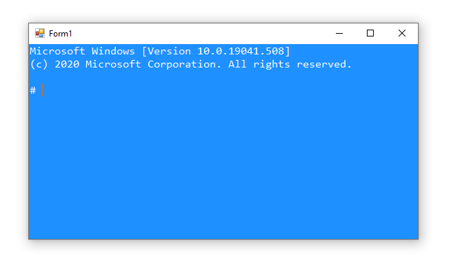

# console
vb.net console simulator control for winform application



## How To

1. Add console control to your form
2. initialize console object in form load event:
```vbnet
Dim console = ConsoleControl1.Console

console.ForegroundColor = ConsoleColor.White
console.SetConsoleBackColor(Color.DodgerBlue)

console.Write("Microsoft Windows [Version 10.0.19041.508]
(c) 2020 Microsoft Corporation. All rights reserved.

# ")
```
3. use console object just like use of the ``System.Console``:
```vbnet
' display data
console.Write(blabla)
console.WriteLine(blabla)

' read data
console.ReadKey()
console.ReadLine
```

That's it!
