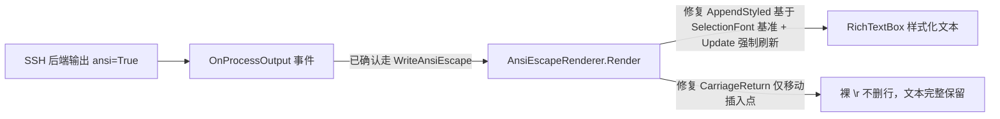

## 用户需求

修复 VB.NET WinForms 控制台模拟控件 `ConsoleControl` 的 ANSI escape 渲染函数 `WriteAnsiEscape`，使其能正确渲染包含 ANSI 转义序列的文本。

## 产品概述

当前项目为 VB.NET + .NET 5 的 WinForms 控制台模拟控件库，使用 RichTextBox 作为输出区。`AnsiEscapeRenderer` 负责将 xterm 子集（CSI/SGR/OSC）解析为带样式的文本。现存在两类渲染缺陷需修复。

## 核心功能

- 含 ANSI escape 序列的文本（前景色、背景色、粗体、斜体、下划线、删除线等）应被正确解析并以对应样式渲染到 RichTextBox，而非显示为无样式的纯文本。
- ubuntu SSH 输出的 ANSI 文本（如 `ls -l` 中蓝色的 `snap`、命令行提示符等）应完整显示，不再变成空白行。
- 维护跨调用延续的终端格式状态，支持被分片到达、尚未结束的转义序列拼接缓冲（SSH 分包场景）。

## 约束与边界

- SSH 后端已正确将 `ansi` 字段设为 `True`，渲染确实通过 `WriteAnsiEscape` 执行，问题出在 `WriteAnsiEscape`/`AnsiEscapeRenderer` 内部，而非事件分发标志。
- 验证使用用户提供的 ubuntu `ls -l` 测试字符串。

## 技术栈

- 语言/框架：VB.NET + .NET 5 + WinForms（现有 `console.NET5.vbproj` 控件库）
- UI 控件：`System.Windows.Forms.RichTextBox`（用作控制台文本输出区）
- 渲染解析：现有 `AnsiEscapeRenderer` 静态类，解析 xterm 子集 CSI/SGR/OSC

## 实现方案

### 总体策略

在确认 SSH 路径已正确进入 `WriteAnsiEscape` 的前提下，修复 `AnsiEscapeRenderer` 内部两处缺陷：把解析得到的 `AnsiTerminalState` 可靠地应用到 RichTextBox（问题1），以及修正裸 `\r` 的回车语义（问题2）。解析逻辑（`ApplySgr`/`ApplyExtendedColor`/`Xterm256Color`/`IsInsideUnterminatedEscape`）经验证正确，保持不动。

### 根因与修复

**根因A（问题1：无样式）—— `AppendStyled` 样式应用与 `WM_SETREDRAW` 挂起绘制**

- `AppendStyled`（第314-324行）当前以 `rtb.Font`（控件级默认字体）为基准构造 `New Font(rtb.Font.FontFamily, rtb.Font.Size, state.Style)`。微软官方文档明确指出：当 `SelectionFont` 指向的选区包含多种字体时返回 `null`，此时直接赋新字体会被**静默忽略**（不抛异常），导致粗体/斜体等 Style 丢失。SSH 分片渲染下相邻文本格式不同（如前段 Bold 后段 Regular），RichTextBox 可能合并同类格式使新 `Select` 选区跨多字体，`SelectionFont` 为 null 从而赋值无效。
- 修复：以 `If(rtb.SelectionFont, rtb.Font)` 取得真实当前字体作为基准，再叠加 `state.Style` 构造新字体；并在赋值前对 null 选区先设置一次无样式基准字体，确保 Style 能被应用。
- `Render`（第52-57行）开头 `SendMessage(WM_SETREDRAW, False)` 暂停绘制，结尾仅 `rtb.Invalidate()`（异步重绘）。在挂起期间设置的 `SelectionColor`/`SelectionFont` 内部格式虽记录，但恢复后仅 `Invalidate` 可能因未触发同步 WM_PAINT 导致格式未及时刷新。修复：恢复绘制后调用 `rtb.Update()` 强制同步重绘（保留 `Invalidate` 以触发完整刷新），或评估去掉挂起绘制（单次调用追加量小，RichTextBox 足够流畅）。

**根因B（问题2：ubuntu 空白行）—— 裸 `\r` 删除整行**

- `CarriageReturn`（第330-342行）遇到裸 `\r` 时执行 `rtb.Select(lineStart, lineEnd-lineStart); rtb.SelectedText=""`，即清空整行。测试字符串中 `\r`（`vbCr`）出现在已写入文本行尾（"ls -l" 行尾、"xieguigang@apache-php:~$ " 行尾），导致刚写入的整行被删空，显示为空白行。
- 正确终端 `\r` 语义：仅把插入点移回当前行首、不删除任何文本。修复为仅 `rtb.SelectionStart = lineStart; rtb.SelectionLength = 0`，移除"清除整行"逻辑。后续文本从行尾追加即可保留已有内容（符合换行后重绘的多数场景；进度条等覆盖式重绘因无后续覆盖文本而保留内容，避免丢字）。

**健壮性增强（可选）**

- `ConsoleControl.processInterace_OnProcessOutput`（第262-272行）：当 `args.Ansi=False` 但 `args.Content` 包含 ESC 字符（`ChrW(&H1B)`）时，降级调用 `WriteAnsiEscape`，避免本地进程未声明 ANSI 却输出转义码时漏渲染。

## 实现注意

- 仅修改样式应用与回车逻辑，不改 SGR 颜色映射、`Xterm256Color`、`AppendStyled` 的文本追加/`Select` 流程、`IsInsideUnterminatedEscape` 等已验证正确的部分。
- 性能：保留分片缓冲与状态延续；`CarriageReturn` 改为仅设 `SelectionStart`，去除整行删除带来的文本重排开销；`Update()` 单次同步重绘开销可忽略。
- 向后兼容：默认格式（白字黑底、常规样式）与现有行为一致；仅修正错误删除与样式丢失。
- 无新增依赖、无新增文件，全部为就地修改。

## 架构设计

修复后数据流：



## 目录结构

```
g:/mini-R/src/console/console/
├── AnsiEscapeRenderer.vb        # [MODIFY] AppendStyled 以 SelectionFont 为基准设置样式并判 null；Render 恢复绘制后调用 Update()；CarriageReturn 仅移动插入点到行首
└── WinForm/
    └── ConsoleControl.vb        # [MODIFY][可选] processInterace_OnProcessOutput 增加含 ESC 字符降级走 WriteAnsiEscape
```

## 关键代码结构

`AppendStyled` 样式应用修正示意（VB.NET 片段）：

```
Private Shared Sub AppendStyled(rtb As RichTextBox, text As String, state As AnsiTerminalState)
    If String.IsNullOrEmpty(text) Then Return
    Dim startPos As Integer = rtb.TextLength
    rtb.AppendText(text)
    rtb.Select(startPos, text.Length)
    rtb.SelectionColor = state.ForeColor
    rtb.SelectionBackColor = state.BackColor
    ' 以当前选区真实字体为基准（null 时回退控件字体），再叠加目标 Style
    Dim baseFont As Font = If(rtb.SelectionFont, rtb.Font)
    rtb.SelectionFont = New Font(baseFont.FontFamily, baseFont.Size, state.Style)
    rtb.SelectionStart = rtb.TextLength
    rtb.SelectionLength = 0
End Sub
```